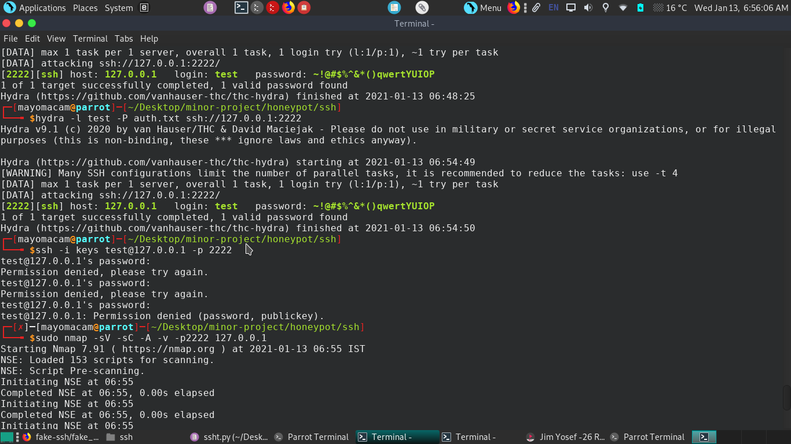
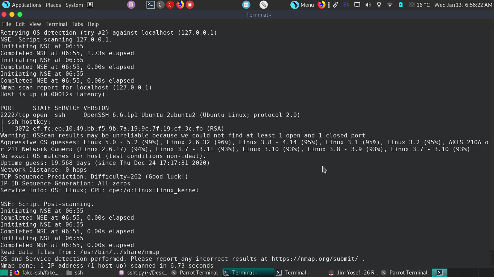
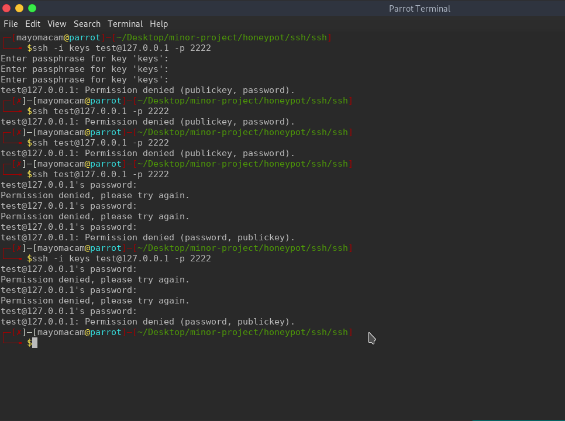

# Honeypot
---
# usage
```
python3 run.py 127.0.0.1 2222 conn.log auth.log
```
upon runing terminal output..
```
┌─[mayomacam@parrot]─[~/Desktop/minor-project/honeypot/ssh/ssh]
└──╼ $python3 run.py 127.0.0.1 2222 conn.log auth.log
Namespace(ip='127.0.0.1', port=[2222], conn='conn.log', auth='auth.log')
127.0.0.1 [2222] conn.log auth.log
Listening for connection ...
************************************************************************************************************************
New login: test:sdaf
New login: test:sdfsdf
New login: test:sdfds
************************************************************************************************************************
New login: test:fasdf
New login: test:sdfsad
New login: test:safdsa
************************************************************************************************************************
************************************************************************************************************************
```
from to bottem
```
┌─[✗]─[mayomacam@parrot]─[~/Desktop/minor-project/honeypot/ssh/ssh]
└──╼ $ssh -i keys test@127.0.0.1 -p 2222
test@127.0.0.1's password: 
Permission denied, please try again.
test@127.0.0.1's password: 
Permission denied, please try again.
test@127.0.0.1's password: 
test@127.0.0.1: Permission denied (password, publickey).
┌─[✗]─[mayomacam@parrot]─[~/Desktop/minor-project/honeypot/ssh/ssh]
└──╼ $ssh test@127.0.0.1 -p 2222
test@127.0.0.1's password: 
Permission denied, please try again.
test@127.0.0.1's password: 
Permission denied, please try again.
test@127.0.0.1's password: 
test@127.0.0.1: Permission denied (password, publickey).
┌─[✗]─[mayomacam@parrot]─[~/Desktop/minor-project/honeypot/ssh/ssh]
└──╼ $hydra -l user -p auth ssh://127.0.0.1:2222
Hydra v9.1 (c) 2020 by van Hauser/THC & David Maciejak - Please do not use in military or secret service organizations, or for illegal purposes (this is non-binding, these *** ignore laws and ethics anyway).

Hydra (https://github.com/vanhauser-thc/thc-hydra) starting at 2021-01-13 09:32:36
[WARNING] Many SSH configurations limit the number of parallel tasks, it is recommended to reduce the tasks: use -t 4
[DATA] max 1 task per 1 server, overall 1 task, 1 login try (l:1/p:1), ~1 try per task
[DATA] attacking ssh://127.0.0.1:2222/
1 of 1 target completed, 0 valid password found
Hydra (https://github.com/vanhauser-thc/thc-hydra) finished at 2021-01-13 09:32:36
```
nmap gonna generate errors and exception in terminal log because of trying to guess about service with different payload.

## Hydra


## nmap


## ssh


# Note:
```
def get_allowed_auths(self, username):
        return "password, publickey"
        #return "publickey, password"
```

here we have to choose which one type of auth we consider most.
if we use
1. password, publickey
So it will take password even if we provide private key, this will take privatekey but gonna ask for user password for to complete the auth... This is what we need for honeypot.

2. publickey, password
This will only auth using private key..

## ssh honeypot

#### Working fine until now
- [x] can login with password.
- [x] even with public key need password to connect.
- [x] can log each entry of login attempt
- [x] can save used creds
- [X] test with using login only with public key
- [X] with banner for hiding from nmap
- [X] adding multiple connection to work
- [X] others auth mechs


#### have to work
- [ ] creating a shell not working
- [ ] add data related command execution
