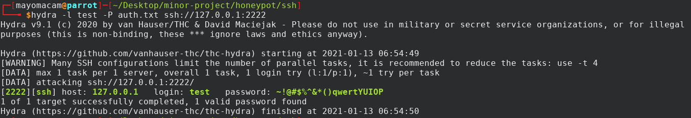

# Honeypot

## ssh honeypot

#### Working fine until now
- [x] can login with password.
- [x] even with public key need password to connect.
- [x] can log each entry of login attempt
- [x] can save used creds
- [X] test with using login only with public key
- [X] with banner for hiding from nmap
- [X] adding multiple connection to work
- [X] others auth mechs

#### have to work
- [ ] creating a shell not working
- [ ] add data related command execution

## Hydra and ssh login

## nmap

