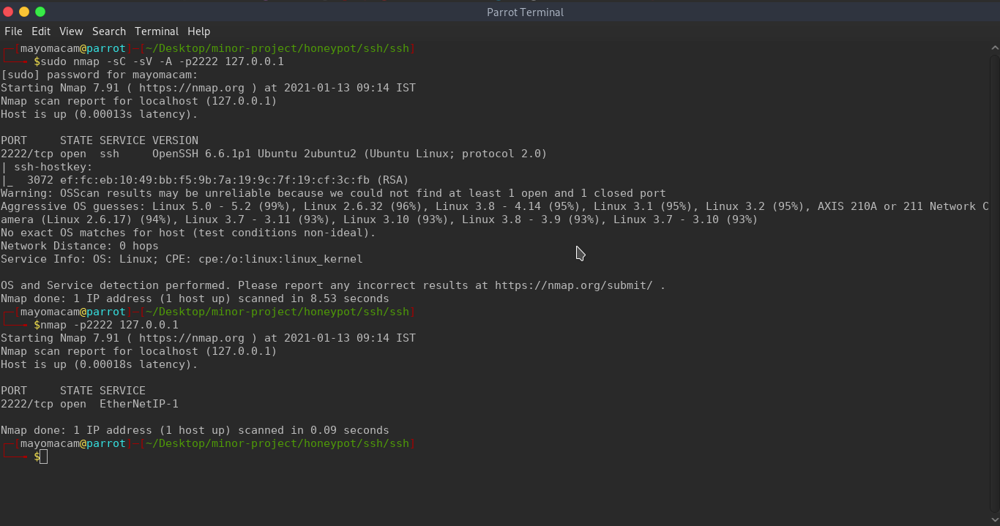

# Honeypot

## ssh honeypot

#### Working fine until now
- [x] can login with password.
- [x] even with public key need password to connect.
- [x] can log each entry of login attempt
- [x] can save used creds
- [X] test with using login only with public key
- [X] with banner for hiding from nmap
- [X] adding multiple connection to work
- [X] others auth mechs


#### have to work
- [ ] creating a shell not working
- [ ] add data related command execution


## Hydra


## nmap


## ssh


# Note:
```
def get_allowed_auths(self, username):
        return "password, publickey"
        #return "publickey, password"
```

here we have to choose which one type of auth we consider most.
if we use
1. password, publickey
So it will take password even if we provide private key.. This is what we need for honeypot.

2. publickey, password
this will take privatekey but gonna ask for user password for to complete the auth.

